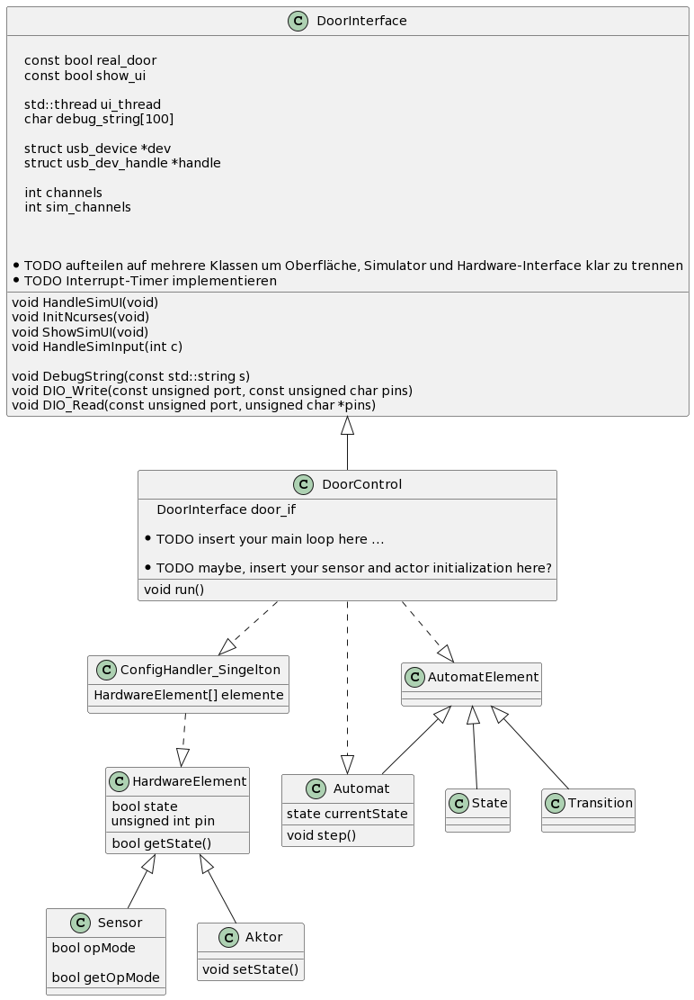
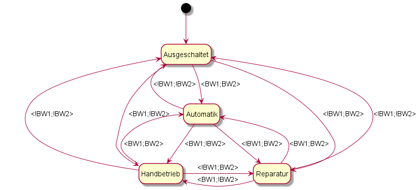
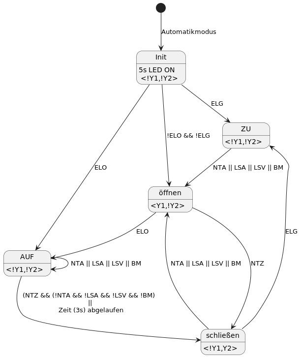
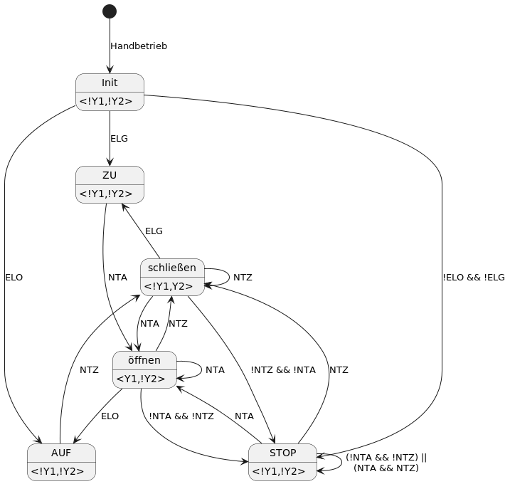
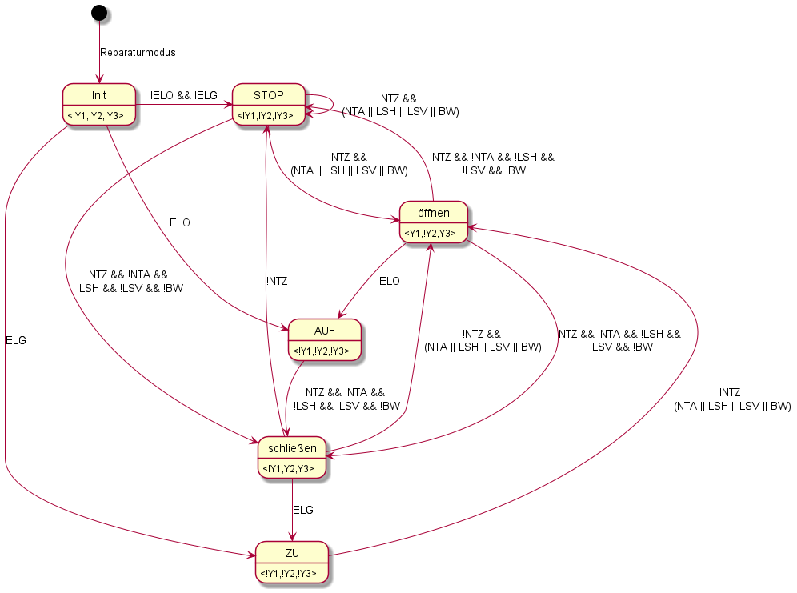

# ART-1_Tuersteuerung
## MRT2 Praktikum, Bereich: Automatisierungs-, Mess- und Regelungstechnik

Dustin Hanusch, Ivo Pavlov

* Praktikumswebseite : https://tu-dresden.de/ing/elektrotechnik/ifa/at/studium/Lehrveranstaltungen/mikrorechentechnik-ii-versuche-art1-und-art3
* Präsentation : 13.06.2022 16:40

//ToDo:

    Tobi & Dustin:
        DoorControl:
            Handbetrieb
            Ausschalten
            Automatik
            Reparatur
            mainLoop
        ConfigHandler
        Config-Datei
    Ivo:
        HardwareElement
            Aktor
            Sensor
    Jakob:
        Automat
            State
            Transition

## Klassendiagramm

## Automaten

