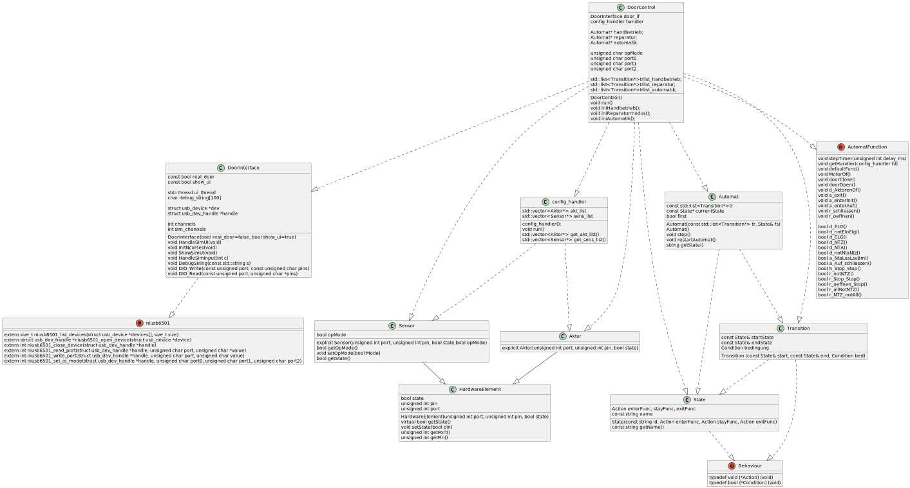

# ART-1_Tuersteuerung
## MRT2 Praktikum, Bereich: Automatisierungs-, Mess- und Regelungstechnik

Dustin Hanusch, Ivo Pavlov

* Praktikumswebseite : https://tu-dresden.de/ing/elektrotechnik/ifa/at/studium/Lehrveranstaltungen/mikrorechentechnik-ii-versuche-art1-und-art3
* Präsentation : 13.06.2022 16:40

//ToDo:

    Tobi & Dustin:
        DoorControl:
            Handbetrieb
            Ausschalten
            Automatik
            Reparatur
            mainLoop
        ConfigHandler
        Config-Datei
    Ivo:
        HardwareElement
            Aktor
            Sensor
    Jakob:
        Automat
            State
            Transition

## Klassendiagramm

## Automaten

Zur Benutzung des Automaten:

- Einen Haufen Zustände definieren. Diese benötigen drei Funktionszeiger: enter-Fkt, stay-Fkt, exit-Fkt (alles void Funktionen)
- einen Haufen Transitionen definieren. Diese benötigen jeweils Zeiger auf den Startzustand und den Zielzustand und einen Funktionszeiger auf die Bedingung (bool-Funktion)

- die Zeiger auf die Transitionen in eine list packen
- einen Automaten definieren. Dieser benötigt die list und einen Zeiger auf den Startzustand
- mit der step()-Funktion wird der Automat einmal darauf geprüft ob ein Zustandswechsel ansteht. Falls der aktuelle Zustand bleibt, wird dessen stay-Fkt ausgeführt
- zur Orientierung ist meine "main-Funktion" in "Testautomat.cpp" 